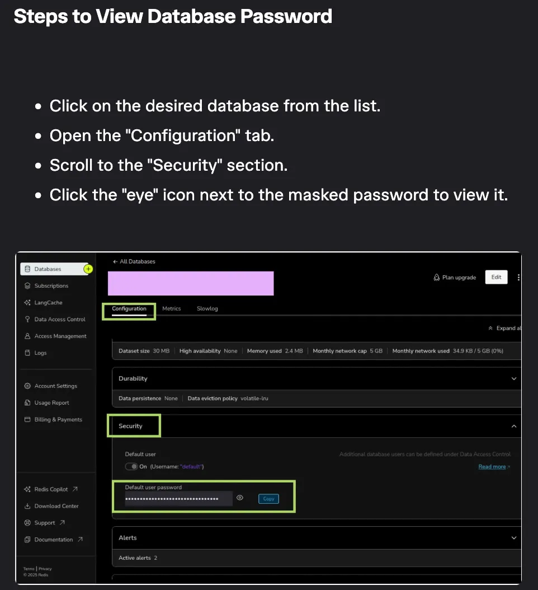

# Chirp API

This project provides a simple API for interacting with the Chirp messaging platform.

## Set Up

This project relies on environment variables for configuration. You need to set the following variables in your
environment:

- POSTGRES_PASSWORD: The password for the PostgreSQL database.
- REDIS_PASSWORD: The password for the Redis server.
- JWT_SECRET_BASE64: A base64-encoded secret key for JWT authentication.

Both PostgreSQL and Redis were used through hosted services (Supabase and Redis Cloud respectively).

To retrieve the Redis password from Redis Cloud, use the following image as a reference:



### Spring profiles

This project uses Spring profiles to manage different configurations for development and production environments. The
active profile can be set by adding the following command line argument when starting the application:

```
-Dspring.profiles.active=dev
```

When using Intellij Community Edition, you can set this in the "Run/Debug Configurations" dialog under "VM options".